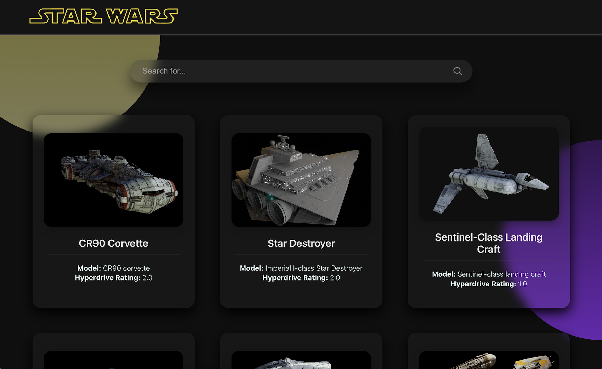

# Star Wars Starships | SWAPI

This project was bootstrapped with [Create React App](https://github.com/facebook/create-react-app). Using API from [SWAPI](https://swapi.dev/).

Starships are listed. The name and model of the starships can be searched and the details of the relevant starship can be accessed.

To see the project in action, go to [SWAPI Starships APP](https://swapi-starships.vercel.app/). 

## Technologies used:

* JavaScript
* CSS
* React.js
* Redux | Redux Toolkit
* React Router - v6
* Axios

## Getting Started

Clone this repo : `git clone https://github.com/iremguunay/swapi-starships.git`

Navigate to the root folder and install all dependencies :

* `yarn install` or `npm install`

Start Development Mode :

* `yarn start` or `npm start`
* Open http://localhost:3000 to view it in the browser.

## Learn More

You can learn more in the [Create React App documentation](https://facebook.github.io/create-react-app/docs/getting-started).

To learn React, check out the [React documentation](https://reactjs.org/).

### Code Splitting

This section has moved here: [https://facebook.github.io/create-react-app/docs/code-splitting](https://facebook.github.io/create-react-app/docs/code-splitting)

### Analyzing the Bundle Size

This section has moved here: [https://facebook.github.io/create-react-app/docs/analyzing-the-bundle-size](https://facebook.github.io/create-react-app/docs/analyzing-the-bundle-size)

### Making a Progressive Web App

This section has moved here: [https://facebook.github.io/create-react-app/docs/making-a-progressive-web-app](https://facebook.github.io/create-react-app/docs/making-a-progressive-web-app)

### Advanced Configuration

This section has moved here: [https://facebook.github.io/create-react-app/docs/advanced-configuration](https://facebook.github.io/create-react-app/docs/advanced-configuration)

### Deployment

This section has moved here: [https://facebook.github.io/create-react-app/docs/deployment](https://facebook.github.io/create-react-app/docs/deployment)

### `npm run build` fails to minify

This section has moved here: [https://facebook.github.io/create-react-app/docs/troubleshooting#npm-run-build-fails-to-minify](https://facebook.github.io/create-react-app/docs/troubleshooting#npm-run-build-fails-to-minify)
